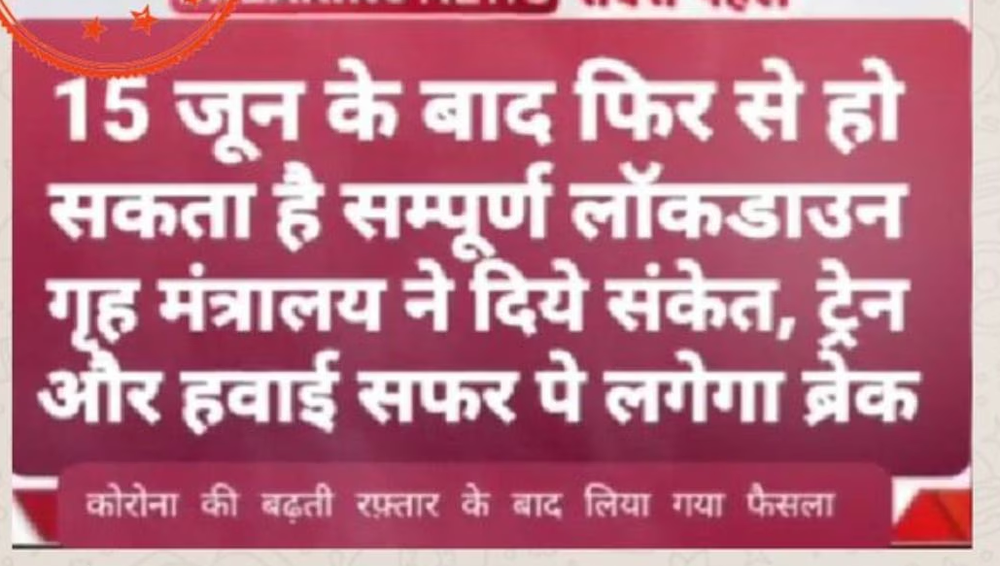
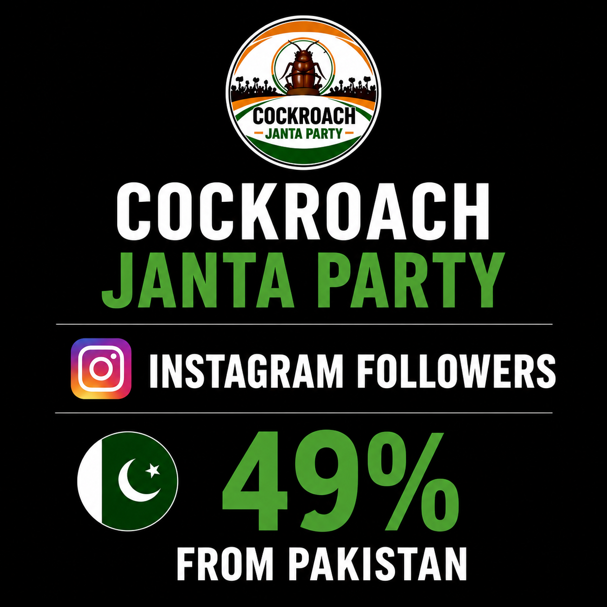
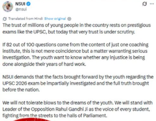

# Juris — Example Investigations

Real claims run through Juris, each with a permalink to the live investigation
(the isolated sub-claims, the searches the agent ran, the cited sources, and the
final verdict).

Claims come in three forms — plain **text**, a **URL**, or an **image**
(screenshot / infographic, read via vision-OCR). The examples below cover text
and image intake.

| # | Claim | Investigation |
|---|-------|---------------|
| 1 |  *(Image — Hindi news card: "full lockdown may return after 15 June, trains and flights to halt")* | [View investigation](https://juris-eta.vercel.app/investigation/ff1e8e3c-6eec-4076-b069-63908331d6da) |
| 2 | 🇮🇳 गर्व की बात! यूनेस्को ने हमारे राष्ट्रगान जन गण मन को दुनिया का सबसे अच्छा राष्ट्रगान घोषित किया है। सभी भारतीयों को यह ज़रूर फॉरवर्ड करें! 🙏  *(Hindi text — "UNESCO named Jana Gana Mana the world's best anthem")* | [View investigation](https://juris-eta.vercel.app/investigation/1a758d8c-34b5-4719-9aff-3db4e36c8938) |
| 3 |  *(Image — "49% of Instagram followers from Pakistan" infographic)* | [View investigation](https://juris-eta.vercel.app/investigation/2dd39e14-9c0f-4d0f-904d-a024f52f24f7) |
| 4 | Proud moment! India is now the most populous country in the world, has overtaken Japan to become the world's 3rd largest economy, and the IMF has declared the Indian Rupee the strongest currency in Asia.  *(English text — mixed true/false bundle)* | [View investigation](https://juris-eta.vercel.app/investigation/e68c50e5-ed6e-4caa-b4f6-f809aeebcb5b) |
| 5 | Chandrayaan-3 India ka mission tha jo 2023 me Moon ke south pole ke paas successfully land hua tha.  *(Hinglish text — Chandrayaan-3 south-pole landing)* | [View investigation](https://juris-eta.vercel.app/investigation/d7fc9e55-41ed-418f-8b78-1aeaf5054a7d) |
| 6 |  *(Image — NSUI tweet on the UPSC 2026 exam)* | [View investigation](https://juris-eta.vercel.app/investigation/0efd003f-11f5-4d02-8daa-9efd80ef945c) |
